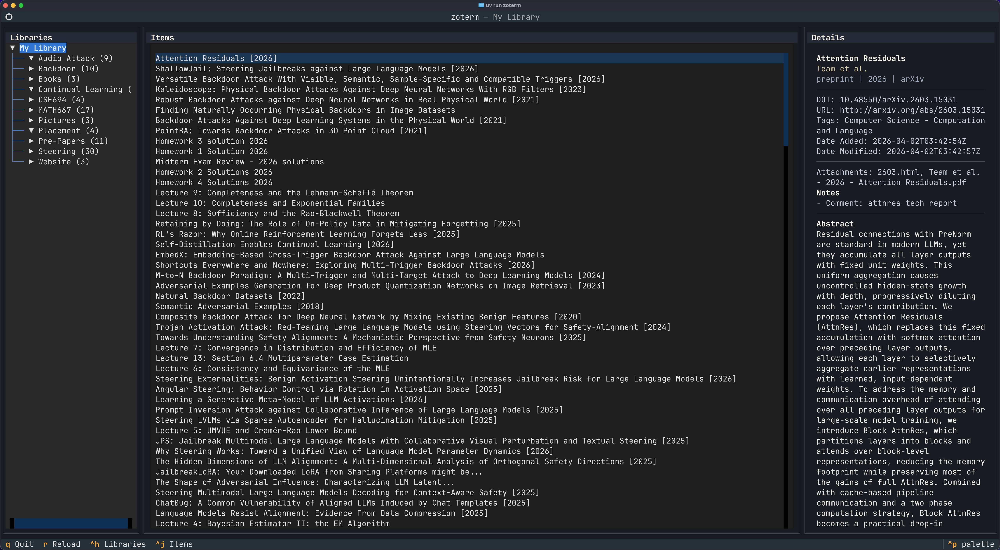

# zoterm

Read-only Zotero TUI built with Python, `uv`, and the local Zotero API.




## Run

```bash
uv sync
uv run zoterm
```

The app reads from `http://localhost:23119/api` by default. Override it with
`ZOTERM_API_BASE_URL` if needed.
